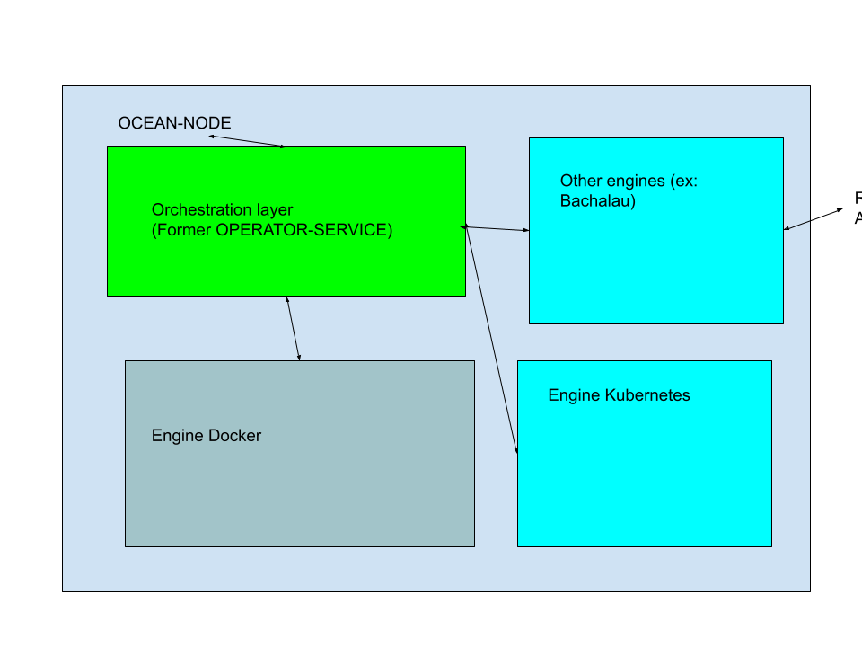
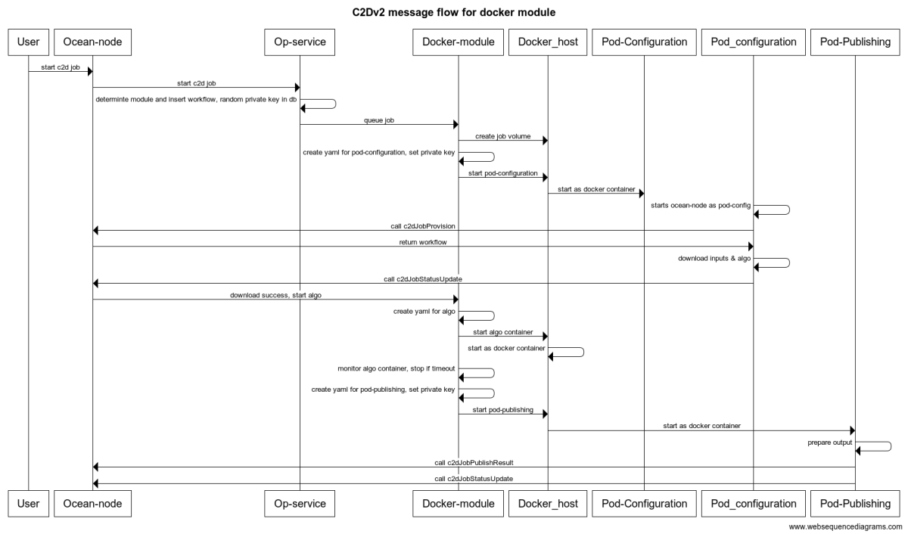

# C2D  V2  ARHITECTURE

C2Dv2 continues the concept of bringing algo to the data, allowing both public and private use of datasets for use with algorithms.
Although the previous versions was relying on external components (Provider -> Operator Service (running in k8) -> multiple Operator-Engines (each running in it's own k8 namespace)), C2DV2 is embedded entirely in ocean-node.

It has a modular approach, allowing multiple compute engines to be connected to the same ocean-node engine.  This compute engines can be internal (docker or k8 (if ocean-node runs in a k8 env)), or external (in future, we could integrate projects like Bachalau, iExec, etc  (TBD))


### Additional features
 - allow multiple c2d engines connected to same ocean-node
 - allow multiple jobs(stages) in a workflow
 - a job can depend(or not) on a previous stage -> parallel/serial jobs




## Workflows
A workflow defines one or more jobs to be executed. Each job may have dependencies from a previous job

```
[
  index: number
  jobId: generated by orchestrator
  runAfter: if defined, wait for specific jobId to finish
  input: [
     index: number
     did?: string
     serviceId: string,
     files?: filesObject
    ],
  algorithm: {
    did?: string
    serviceId?: string
    files?: filesObject
    rawcode?: string
    container?: {
        entrypoint: string
        image: string
        tag: string
    }
  }.
  compute:{
    cpu:number,
    ram:number,
    disc:number,
    maxDuration:number
  }
]
```


## Orchestration layer

Former known as "operator-service", this layer handles interactions between ocean-node core layer and different execution environments.

In a nutshell, it should:
- take a new job (created by startJob core handler)
- determine which module to use (docker, k8, Bachalau, etc)
- insert workflow in database
- signal module handler to take over the job execution
- read workflow status when c2d getStatus core is called
- serve job results when c2d getJobResult is called
     
Since, due to technical constrains, both internal modules (docker and k8) will use docker images for data provisioning (old pod-configuration) and results publishing (old pod-publishing), orchestration layer will also expose three new core commands:
- c2dJobProvision (called by pod-configuration executor to get the workflow input definition)
- c2dJobStatusUpdate (called by both pod-config and pob-publishing to update job status)
- c2dJobPublishResult (called by pod-publishing when results have to be uploaded)

When any of pod-** will call one of those three endpoints, we must verify the signature and respond accordingly

### Payment flow in Orchestration
 Will be based on a escrow contract.
 Orchestrator will:
   - compute sum(maxDuration) from all jobs in the workflow
   - calculate required fee (depend on previous step, token, environment, etc)
   - lock amount in escrow contract
   - wait until all jobs are finished (success or not)
   - calculate actual duration spent
   - compute proof
   - withdraw payment & put proof and release the difference back to the customer.  


## C2D Engines 
A C2D Engine is a piece of code that handles c2d jobs that are running on a specific orchestration implementation.

This documents focuses on internal compute engines:
     - Docker based  (host with docker environment installed)
     - K8 based (if ocean-node runs inside a k8 cluster)

An engine that uses external services (like Bachalau) has the same logic, but mostly likely will interact with remote APIs

An engine is responsible for:
 - exposing list of compute environments to orchestration layer
 - exposing list of running jobs and limits (max concurrent jobs, etc)  to orchestration layer
 - store workflows and each job status (so, on restart we can resume flows or continue running flow)
 - queue new jobs


### Docker engine
  This module requires docker service installed at the host level. 
  
  It will leverage Docker API to:
   - create job volume (with quotas)
   - start provisioning container (aka pod-configuration)
   - monitor it's status
   - create yml for algo, with hw constrains (cpu,ram)
   - pass devices for gpu envs
   - start algorithm container
   - monitor algo health & timeout constrains
   - stop algo if quota is exceeded
   - start publishing container
   - delete job volume 

```
title C2Dv2 message flow for docker module
User -> Ocean-node: start c2d job
Ocean-node -> Op-service: start c2d job
Op-service -> Op-service: determine module and insert workflow, random private key in db
Op-service -> Docker-module: queue job
Docker-module -> Docker_host:  create job volume
Docker-module -> Docker-module: create yaml for pod-configuration, set private key
Docker-module -> Docker_host: start pod-configuration
Docker_host -> Pod-Configuration: start as docker container
Pod_configuration -> Pod_configuration: starts ocean-node as pod-config
Pod_configuration -> Ocean-node: call c2dJobProvision
Ocean-node -> Pod_configuration: return workflow
Pod_configuration -> Pod_configuration : download inputs & algo
Pod_configuration -> Ocean-node: call c2dJobStatusUpdate
Ocean-node -> Docker-module: download success, start algo
Docker-module -> Docker-module: create yaml for algo
Docker-module -> Docker_host: start algo container
Docker_host -> Docker_host: start as docker container
Docker-module -> Docker-module: monitor algo container, stop if timeout
Docker-module -> Docker-module: create yaml for pod-publishing, set private key
Docker-module -> Docker_host: start pod-publishing
Docker_host -> Pod-Publishing: start as docker container
Pod-Publishing -> Pod-Publishing : prepare output
Pod-Publishing -> Ocean-node: call c2dJobPublishResult
Pod-Publishing -> Ocean-node: call c2dJobStatusUpdate

```



### kubernetes engine
  This module requires access to k8 credentials (or autodetect them if ocean-node already runs in a k8 cluster). 
  
  It will leverage K8 API to:
   - create job volume (with quotas)
   - start provisioning container (aka pod-configuration)
   - monitor it's status
   - create yml for algo, with hw constrains (cpu,ram)
   - pass devices for gpu envs
   - start algorithm container
   - monitor algo health & timeout constrains
   - stop algo if quota is exceeded
   - start publishing container
   - delete job volume 


## POD-* common description

   For a efficient communication between ocean-node and the two containers, the easiest way is to use p2p/http api.
   Thus, all pod-* will run a ocean-node instance (each will have a job generated random key), and they will connect to the main ocean-node instance. Main ocean-node instance peerNodeId or http API endpoint will be inserted in yaml.
   Each pod-** will use a private key, also exposed in yaml.

   So, each yml of pod-* will contain the following envs:
    - nodePeerId ?
    - nodeHttpApi ?
    - privateKey

    
### Pod-configuration
 In the past, pod-configuration was a standalone repo, built as docker image.
 In this implementation, it will be ocean-node, with a different entrypoint (entry_configuration.js)

 Implementation:
  - call ocean-node/c2dJobProvision and get workflow's input section
  - download all assets
  - call ocean-node/c2dJobStatusUpdate core command to update status (provision finished or errors)

  
### Pod-publishing
 In the past, pod-publishing was a standalone repo, built as docker image.
 In this implementation, it will be ocean-node, with a different entrypoint (entry_publishing.js)

 Implementation:
  - read output folder
  - if multiples files or folders are detected, create a zip with all those files/folders
  - call ocean-node/c2dJobPublishResult core command and let ocean-node handle storage
  - call ocean-node/c2dJobStatusUpdate core command to update job as done

