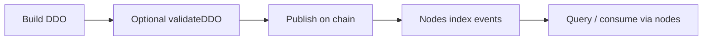

# Publishing assets and isolated markets

This document describes how assets (DDOs) move from a publisher’s machine into the Ocean network, how Ocean Nodes index them, and how you can restrict **who indexes what** to build **isolated markets**—logical subsets of the public network that share the same chain but apply stricter rules on the node side.

---

## The default (public) flow

In the usual setup, every Ocean Node that follows the network is free to index every asset that appears on chain, subject to normal validation (factory deployment, hashes, optional Policy Server hooks on the indexer, etc.).

1. **Build the DDO locally**  
   You construct a valid DDO with [ocean.js](https://github.com/oceanprotocol/ocean.js) (or equivalent tooling).

2. **Optional: validate against one or more nodes**  
   Before publishing, you can call the **`validateDDO`** command on a node (HTTP `POST /directCommand` or P2P). The node checks the DDO shape and rules; if [Policy Server](./PolicyServer.md) is configured, it can run extra authorization checks. On success, the node may return a **validation signature** payload (see [API](./API.md#validate-ddo)) used when you publish so the chain can record **which validator** approved the metadata.

3. **Publish on chain**  
   You submit the metadata transaction (create/update) so the asset is anchored on the target chain.

4. **Indexing**  
   Every node that indexes that chain processes the relevant events and stores the DDO in its local index (e.g. Typesense/Elasticsearch), so the asset becomes discoverable through those nodes’ APIs.

Nothing in this flow *requires* an allowlist: if your nodes do not set the isolation options below, they behave as part of the open network.



---

## Isolated markets

An **isolated market** is not a separate blockchain; it is a **policy** you enforce by configuring groups of Ocean Nodes so they only index (and thus only advertise) assets that satisfy your rules. You can combine several mechanisms.

| Mechanism | What it restricts | Typical use |
|-----------|-------------------|-------------|
| `ALLOWED_VALIDATORS` / `ALLOWED_VALIDATORS_LIST` | Only assets whose publishing tx includes approval from **allowed validator addresses** | Org-approved catalog |
| `AUTHORIZED_PUBLISHERS` / `AUTHORIZED_PUBLISHERS_LIST` | Only assets whose **on-chain owner** is allowlisted | Known publishers only |
| `AUTHORIZED_DECRYPTERS` / `AUTHORIZED_DECRYPTERS_LIST` | Which **nodes** may call **`decryptDDO`** on the node that encrypted metadata | Encrypted DDO + indexer allowlist |

Environment variable names and JSON shapes are documented in [env.md](./env.md).

---

## Scenario 1 — Validator-gated indexing (`ALLOWED_VALIDATORS`)

**Goal:** Only index assets that were **validated by a specific node** (or set of nodes), e.g. an organization that runs a “gatekeeper” node with extra checks.

**How it works**

1. **Gatekeeper node**  
   Run a node (`node1`) that performs `validateDDO`. Optionally connect it to a **Policy Server** so enterprise rules (SSO, LDAP, VC checks, etc.) run before the node signs—see [PolicyServer.md](./PolicyServer.md).

2. **Validation signature**  
   When validation succeeds, the node returns signing material (the node signs a hash derived from the DDO using its **provider wallet**). Your client must pass this through **ocean.js** when publishing so the protocol emits **`MetadataValidated`** in the **same transaction** as metadata creation/update. Indexers look for those events and read **validator addresses** from them.

3. **Isolated indexers**  
   On every node that should **only** follow that gatekeeper, set:

   ```bash
   ALLOWED_VALIDATORS='["0xGatekeeperNodeProviderAddress"]'
   ```

   Use the **Ethereum address** of the gatekeeper node’s signing key (the same key used when producing the validation signature). You can list multiple addresses.

4. **Access lists (optional)**  
   `ALLOWED_VALIDATORS_LIST` maps **chain ID → AccessList contract addresses**. If set, at least one on-chain validator must appear on those lists (see implementation and [env.md](./env.md)).

**Outcome:** Nodes with `ALLOWED_VALIDATORS` set **skip** metadata events whose transaction does not include a `MetadataValidated` proof, or where none of the validators match your allowlist. Other nodes on the network—without this setting—still index everything as usual.

---

## Scenario 2 — Publisher allowlists (`AUTHORIZED_PUBLISHERS`)

**Goal:** Index only assets published by **specific wallets**, regardless of which validator signed (or use this together with Scenario 1).

**How it works**

- The indexer checks the **Data NFT owner** (`owner` from the metadata event) against your configuration.
- If `AUTHORIZED_PUBLISHERS` is non-empty, the owner must correspond to **one of the listed addresses** (compared case-insensitively against the configured list).
- If `AUTHORIZED_PUBLISHERS_LIST` is set, the owner must satisfy the **AccessList** contracts for that chain.

**Example (conceptual)**

```bash
# Only these publishers’ assets are indexed
AUTHORIZED_PUBLISHERS='["0xPublisherA...","0xPublisherB..."]'
```

**Combining with validators:** Set both `ALLOWED_VALIDATORS` and `AUTHORIZED_PUBLISHERS`. An asset is indexed only if it passes **both** checks.

---

## Scenario 3 — Encrypted DDO and decrypt allowlists (`AUTHORIZED_DECRYPTERS`)

**Goal:** At publish time, pick **one node** to encrypt the DDO; only **authorized** other nodes can decrypt it during indexing, so only those nodes can build a full index entry.

**How it works**

1. **Publishing**  
   When encrypting metadata for chain storage, you choose a node (often via its HTTP URL or peer id, depending on client flow). That node’s **`encrypt`** path prepares ciphertext that other parties cannot read without going through **`decryptDDO`**.

2. **On-chain reference**  
   The encrypted payload is stored/ referenced such that indexers know **which node** can decrypt (HTTP URL of the encrypting node, or the node’s peer id for local decrypt).

3. **Indexing and `decryptDDO`**  
   When another node indexes the asset, it must call the encrypting node’s **`POST /api/services/decrypt`** (with a nonce and signature proving the caller). The decrypting node checks whether the requester’s **`decrypterAddress`** (the indexing node’s own Ethereum address) is allowed.

4. **`AUTHORIZED_DECRYPTERS` on the encrypting node**  
   On the node that holds the decryption keys, set:

   ```bash
   AUTHORIZED_DECRYPTERS='["0xIndexerNode1...","0xIndexerNode2..."]'
   ```

   If this list is **non-empty**, only those addresses **or** the encrypting node itself may decrypt. Everyone else receives **403** and **cannot** complete indexing for that ciphertext.

5. **Access lists (optional)**  
   `AUTHORIZED_DECRYPTERS_LIST` restricts callers via **AccessList** contracts per chain (see [env.md](./env.md)).

**Outcome:** The asset may exist on chain for everyone, but **only nodes you list** can successfully decrypt and index it. Others fail at decrypt and leave the asset out of their index.

---

## Combining scenarios (example)

A private catalog might use:

- **`ALLOWED_VALIDATORS`:** only your org’s gatekeeper node address.
- **`AUTHORIZED_PUBLISHERS`:** only approved data-owner wallets.
- **Encrypted DDO + `AUTHORIZED_DECRYPTERS`:** only your federation’s indexer node addresses can call `decrypt` on the encryption node.

Tune each layer to match how much you trust **validators**, **publishers**, and **indexer machines**.

---

## Other useful knobs

- **`INDEXER_NETWORKS`:** Limit which chains a node indexes (see [env.md](./env.md)).
- **Policy Server on the indexer:** Even in public mode, your indexer can call Policy Server on **`newDDO`** / **`updateDDO`** to reject indexing—orthogonal to the allowlists above but complementary for org-wide policy.
- **`VALIDATE_UNSIGNED_DDO`:** Controls whether `validateDDO` requires publisher proofs before signing; relevant when hardening validation flows (see [env.md](./env.md)).

---

## Where to read next

| Topic | Doc |
|--------|-----|
| All env vars (`ALLOWED_*`, `AUTHORIZED_*`, lists) | [env.md](./env.md) |
| Policy Server actions (`validateDDO`, `newDDO`, …) | [PolicyServer.md](./PolicyServer.md) |
| `validateDDO` command shape | [API.md](./API.md#validate-ddo) |
| Key / signing model | [KeyManager.md](./KeyManager.md) |

For client-side steps (exact ocean.js calls to pass validation into `MetadataValidated` and to choose an encrypting node), refer to the **ocean.js** documentation and examples for your stack version; the on-chain requirement from the node’s perspective is **`MetadataValidated` in the publishing transaction** when using `ALLOWED_VALIDATORS`, and successful **`/api/services/decrypt`** when metadata is encrypted.
